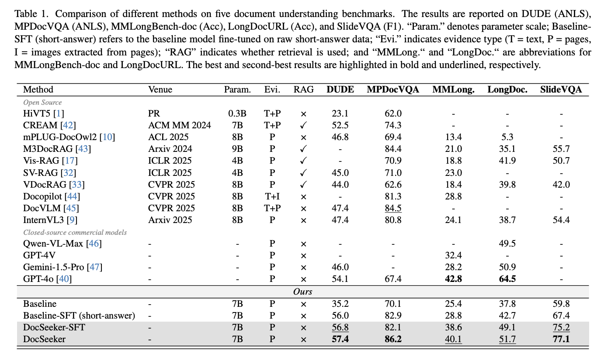

<!-- omit in toc -->
DocSeeker: Structured Visual Reasoning with Evidence Grounding for Long Document Understanding (CVPR 2026 Hignlight)
================================================================
Hao Yan, Yuliang Liu, Xingchen Liu, Yuyi Zhang, Minghui Liao, Jihao Wu, Wei Chen, Xiang Bai

<h5 align="center">

[](https://arxiv.org/abs/XXXX.XXXXX)
[](https://your-project-page.github.io/)
[](./README.md)
[]()
<br>
</h5>


## News

* `2026.x.x` 📄 Paper released on arXiv.
* `2026.x.x` 🚀 Code / model / demo will be released soon.
* `2026.4.9` 🔥 **DocSeeker** is accepted to **CVPR 2026** as a **Highlight** paper.


---

## Introduction

**DocSeeker** is a multimodal large language model for **long document understanding**. Existing MLLMs often struggle as document length grows, because crucial evidence is easily buried in many irrelevant pages, while most training data only provides short final answers without explicit evidence grounding.

To address this, DocSeeker introduces a structured **Analysis–Localization–Reasoning (ALR)** paradigm, which encourages the model to first analyze the question, then localize evidence pages, and finally perform grounded reasoning before generating the answer. Built on **Qwen-2.5-VL-7B-Instruct**, DocSeeker further combines **ALR CoT distillation**, **Evidence-aware GRPO**, and **Evidence-Guided Resolution Allocation (EGRA)** for effective long-document training. This leads to strong gains on both in-domain and out-of-domain benchmarks, while making the reasoning process more interpretable and evidence-grounded.

---

## Highlights

- **A new structured reasoning paradigm for long documents.**  
  We propose **ALR (Analysis–Localization–Reasoning)**, which turns long-document QA from direct answer prediction into an explicit evidence-grounded reasoning process.

- **Evidence-grounded training instead of answer-only supervision.**  
  DocSeeker is trained with a two-stage pipeline that combines **high-quality ALR CoT distillation** and **Evidence-aware GRPO**, explicitly optimizing both **evidence localization** and **answer correctness**.

- **Efficient long-document learning with EGRA.**  
  We introduce **Evidence-Guided Resolution Allocation (EGRA)**, which preserves high resolution for evidence pages while reducing redundant cost on non-evidence pages, enabling more effective and scalable training on long visual documents.

---

## Main Results

DocSeeker achieves strong performance across both in-domain and out-of-domain long document benchmarks, outperforming representative open-source long-document MLLMs and remaining competitive with strong closed-source models.

<p align="center">
    
<p>

DocSeeker sets strong results on **DUDE**, **MP-DocVQA**, and **SlideVQA**, and substantially outperforms representative open-source methods on challenging long-document benchmarks such as **MMLongBench-doc** and **LongDocURL**.

---


## Environment

```bash
# Coming soon
```

---

## Implementation

Data distillation
```bash
# Coming soon
```
---

Supervised Fine-tuning
```bash
# Coming soon
```

Evi-GRPO
```bash
# Coming soon
```

Evaluation
```bash
# Coming soon
```

---

## Citation

```bibtex
@inproceedings{yan2026docseeker,
  title     = {DocSeeker: Structured Visual Reasoning with Evidence Grounding for Long Document Understanding},
  author    = {Hao Yan and Yuliang Liu and Xingchen Liu and Yuyi Zhang and Minghui Liao and Jihao Wu and Wei Chen and Xiang Bai},
  booktitle = {Proceedings of the IEEE/CVF Conference on Computer Vision and Pattern Recognition},
  year      = {2026}
}
```

---
## Acknowledgement
Our work benefit from the following open-source projects:
- [Qwen2.5 VL](https://github.com/QwenLM/qwen-code)
- [verl](https://github.com/volcengine/verl)


## Contact

For questions and collaborations, please contact the authors of the paper.
